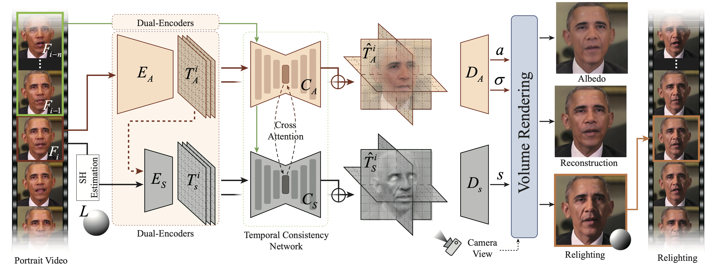

# Real-time 3D-aware Portrait Video Relighting
PyTorch implementation of the CVPR 2024 Highlight Paper



**Real-time 3D-aware Portrait Video Relighting**</br>

Abstract: Synthesizing realistic videos of talking faces under custom lighting conditions and viewing angles benefits various downstream applications like video conferencing. However, most existing relighting methods are either time-consuming or unable to adjust the viewpoints. In this paper, we present the first real-time 3D-aware method for relighting in-the-wild videos of talking faces based on Neural Radiance Fields (NeRF). Given an input portrait video, our method can synthesize talking faces under both novel views and novel lighting conditions with a photo-realistic and disentangled 3D representation. Specifically, we infer an albedo tri-plane, as well as a shading tri-plane based on a desired lighting condition for each video frame with fast dual-encoders. We also leverage a temporal consistency network to ensure smooth transitions and reduce flickering artifacts. Our method runs at 32.98 fps on consumer-level hardware and achieves state-of-the-art results in terms of reconstruction quality, lighting error, lighting instability, temporal consistency and inference speed. We demonstrate the effectiveness and interactivity of our method on various portrait videos with diverse lighting and viewing conditions.

---

## Table of Contents

- [Installation](#installation)
- [Quick Start](#quick-start)
- [Usage](#usage)
  - [Image Relighting](#image-relighting)
  - [Video Relighting](#video-relighting)
- [Citation](#citation)
- [License](#license)
- [Acknowledgements](#acknowledgements)


## Installation

### Prerequisites

The code has been tested in the following environment:
- **CUDA**: 12.4
- **PyTorch**: 2.2.2
- **Python**: 3.10.14
- **GCC**: 11.4.0
- **Ubuntu**: 22.04


### Steps

1. Clone the repository:

    ```bash
    git clone https://github.com/Shubhama21/PortraitRelighting.git
    cd PortraitRelighting
    ```

2. Set up a virtual environment:

    ```bash
    conda create -n relighting python=3.10
    conda activate relighting
    ```

3. Install dependencies:

    ```bash
    pip install -r requirements.txt
    ```

4. [Download](https://drive.google.com/file/d/1bYpvIJNrIdce4RIgSSv6GxDKLe0XJpEv/view?usp=drive_link) pre-trained models and save them in the `checkpoints/` directory.

5. Download NeRFFaceLighting-ffhq-64.pkl from [here](https://drive.google.com/drive/folders/1MT1aZJa0GEblJv4YUyVNi0BdwgGnQB_I) and rename it to `NeRFFaceLighting.pkl`. Save it in the `checkpoints` directory.

6. Go to the [link](https://github.com/sicxu/Deep3DFaceRecon_pytorch/tree/master) to download its `BFM` directory, follow the `Prepare prerequisite models` section (we set 'model_name' as 'pretrained' ), and put its supplemented `BFM` and `checkpoints` directories under `third_party/CropPose` directory.

## Quick Start

To quickly relight an image or video, simply run the example script:

```python
python example.py
```

The relighted outputs will be saved in the examples/ directory.

## Usage

### Image Relighting

1. Initialize the Model

Set up the environment and load the necessary models:

```python
device = torch.device("cuda" if torch.cuda.is_available() else "cpu")
cropposer, relighting, dpr = initialize_models(device)
example_lightings = np.load("examples/example_lightings.npy")
```

2. Warm-up the Models

Prepare the models for inference:

```python
warm_up_models(cropposer, relighting, dpr, device)
```

3. Reconstruct the Input Image (optional)

Optionally, reconstruct the input image before relighting:

```python
cropped_image, cam, planes = reconstruct_image(cropposer, relighting, dpr, device)
```

If you prefer to relight an image with a custom camera pose, you can directly modify the cam and sh parameters in the reconstruct_image function, instead of estimating them from the input image.

4. Perform Relighting

Apply relighting to the image using the pre-loaded lighting settings:

```python
perform_relighting(cropped_image, planes, relighting, device, example_lightings)
```


